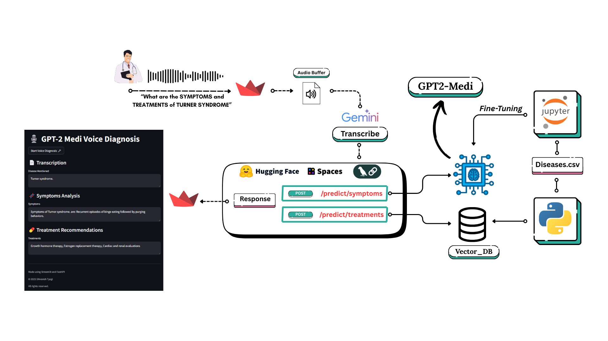
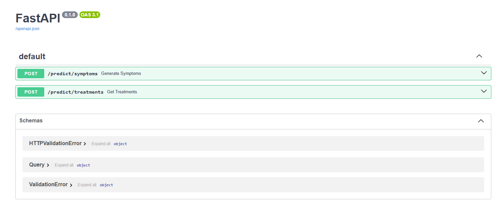
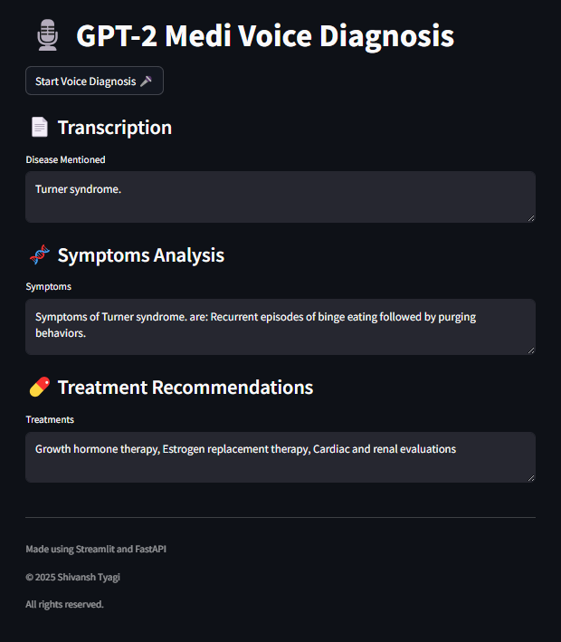

# Gpt2Medi
An AI-powered medical assistant for doctors to get both **symptoms** and **treatments** of any specific disease using:
- 🧠 A fine-tuned GPT-2 model for symptom generation.
- 🔍 A RAG pipeline for treatment info retrieval via ChromaDB.
- 🎤 Voice input support.
- 🚀 FastAPI backend, Dockerized & Hugging Face hosted.

## Fine Tuning GPT-2
Take a look at this [Jupyter Notebook](Tools/Gpt2-Medi.ipynb) for the Fine-Tuned Gpt-2 on [Disease-Symptom Dataset](https://huggingface.co/datasets/QuyenAnhDE/Diseases_Symptoms)

## Architecture



---

Gpt2Medi is deployed on HuggingFace via endpoint: https://cosmic09-gpt2medi.hf.space/docs 



---

## Streamlit app



## 🚀 How to Run
### 1. Clone the Repo

```bash
git clone https://github.com/ShivanshTyagi9/Gpt2Medi.git
cd Gpt2Medi
```

### 2. Install Requirements

```bash
pip install -r requirements.txt
```
Make sure your Python version is 3.10+ and you have a CUDA-enabled GPU (optional but recommended).

### 3. Running the assistant
- Using Hugging Face Endpoints:
  Update Endpoint to:
  ```python
  SYMPTOM_API_URL = "https:/cosmic09-gpt2medi.hf.space/predict/symptoms"
  TREATMENT_API_URL = "https:/cosmic09-gpt2medi.hf.space/predict/treatments"
  ```
  ```bash
  Streamlit run gui.py
  ```
- Running the server Locally:
  
  a. Build the fine-tuned Gpt2:
     ```bash
     cd Tools
     python gpt2medi.py
     ```
  b. Build the vector storage:
     ```bash
     python create_db.py
     ```
  c. Run the FastApi Server:
     ```bash
     cd ..
     uvicorn app.main:app --reload
     ```
  d. Run the Streamlit app:
     ```bash
     Streamlit run gui.py
     ```
